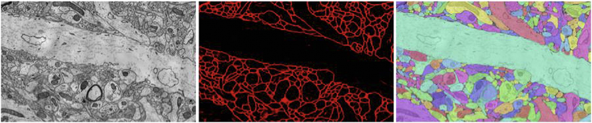

.. meta::
   :description: Official documentation for ocptilecache: Caching Gateway to connect a CATMAID server to Open Connectome Project Web Services
   :keywords: annotation, tracing, neuroscience, object detection
.. title::
   ocptilecache

.. raw:: html

	<h1>ocptilecache: Caching Gateway to connect a CATMAID server to Open Connectome Project Web Services</h1>
	 

    
    Spatially Registered Databases in the Open Connectome Project   

    Electron microscopy images of a mouse somatosensory cortex (left), a probability map output by a computer vision algorithm that detects membranes (center), and an annotation database that describes axons and dendrites (right).

.. raw:: html
 
  

    
    
     <a href="https://github.com/openconnectome/open-connectome/zipball/master"> [ZIP]   </a>  
    <a image="_static/GitHub.png" href="https://github.com/openconnectome/open-connectome/tarball/master">[TAR.GZ] </a>

  

.. sidebar:: OCP Contact Us 
   
   If you have questions about OCP, or have data to store, please let us know:  ocp-support@googlegroups.com
   
.. toctree::
   :maxdepth: 1
   :caption: Documentation

   sphinx/config
   sphinx/faq
   api/ocp_types
   api/tilecache_api

.. toctree::
   :maxdepth: 1
   :caption: Further Reading

   api/functions
   Gitter chatroom <https://gitter.im/openconnectome/ocptilecache>
   Mailing List <https://groups.google.com/forum/#!forum/ocp-support/> 
   Github repo <https://github.com/openconnectome/ocptilecache>
   Release Notes <https://github.com/openconnectome/ocptilecache/releases/>

If you use OCP or its data derivatives, please cite:
  R Burns, K Lillaney, E Perlman, P Manavalan, JT Vogelstein (2015). ocp v0.7. Zenodo. 10.5281/zenodo.15974 `zenodo <https://zenodo.org/record/15974?ln=en#.VYyl-XUVhBc>`_ `bibtex <https://zenodo.org/record/15974?ln=en#.VYyjE3UVhBc>`_
